# Autonomous Incident Response: Device Isolation

An advanced Azure Logic App playbook that automatically isolates compromised devices using Microsoft Defender for Endpoint and Azure OpenAI summarization.

## What This Playbook Does

* Triggers from Microsoft Sentinel automation rules that invoke the Logic App incident webhook.
* Retrieves device and alert evidence from Microsoft Graph and Defender for Endpoint.
* Identifies active remediation events and active device entities.
* Uses an Azure OpenAI agent (`gpt-4o-mini`) to generate concise pre-isolation summaries with Enterprise Data Protection (EDP).
* Applies conditional network isolation with server/workstation and after-hours guardrails.
* Confirms isolation completion through Microsoft Defender for Endpoint machine action polling.
* Sends SOC notification emails based on isolation outcome, asset classification, and control settings.

## Workflow Architecture

### Trigger

* [`deploy/automation-rules/sentinel-on-creation.json`](deploy/automation-rules/sentinel-on-creation.json) fires on incident creation when the title matches configured trigger keywords.
* [`deploy/automation-rules/sentinel-on-update.json`](deploy/automation-rules/sentinel-on-update.json) fires on incident update when new alerts are added and the title matches configured trigger keywords.
* [`deploy/logic-app/workflow.json`](deploy/logic-app/workflow.json) is the deployable ARM template for the Logic App workflow.

## Simplified Logic App Flowchart

```mermaid
flowchart TD
    %% Triggers & Initialization
    Trigger([Sentinel Incident Trigger]) --> GetIncident[Get Incident Details]
    GetIncident --> InitVars[Initialize Variables]
    InitVars --> GetSecret[Get Graph API Secret from Key Vault]

    %% Alert Processing Loop
    GetSecret --> ForEachAlertBlock
    
    subgraph ForEachAlertBlock [🔁 For Each Alert in Incident]
        direction TB
        GetAlertDetails[Get Security Alert Details from Graph] --> FilterRemediation{Is Active<br>File Evidence Present?}
        FilterRemediation -->|Yes| AppendLists[Add to Active Entities and Alerts]
        FilterRemediation -->|No| SkipAlert[Skip Alert]
    end

    %% Control Gates
    ForEachAlertBlock --> ClosedControl{Closed Control Enabled<br>and Incident Closed?}
    ClosedControl -->|Yes| TerminateClosed([❌ Terminate Playbook])
    
    ClosedControl -->|No| PreventedControl{Prevented Control Enabled<br>and Title Says Prevented/Blocked?}
    PreventedControl -->|Yes| TerminatePrevented([❌ Terminate Playbook])

    %% Data Preparation
    PreventedControl -->|No| ComposeIncidentURL[Generate Incident Portal Link]
    ComposeIncidentURL --> ComposeAlerts[Compile Active Alert Data]
    ComposeAlerts --> SummaryAgent[Generate AI Summary]

    %% Host Isolation Loop
    SummaryAgent --> ForEachHostBlock

    subgraph ForEachHostBlock [🔁 For Each Unique Active Host]
        direction TB
        CheckHours[Check Business Hours] --> SetIDs[Set Machine and AAD Device IDs]
        SetIDs --> GetMachine[Get Device Details from MDE]
        GetMachine --> SetDeviceName[Set Device Name]
        SetDeviceName --> SetOS[Set OS Platform]
        SetOS --> CheckOS{Server or Linux?}
        
        CheckOS -->|Yes| SetServerTrue[Mark as Server]
        CheckOS -->|No| SetServerFalse[Mark as Workstation]
        
        SetServerTrue & SetServerFalse --> IsolationLogic{Should Device Be Isolated?}
        
        %% Isolation Actions
        IsolationLogic -->|Yes| IsolateMachine[Trigger MDE Network Isolation]
        IsolateMachine --> MarkIsolated[Set IsIsolated = True]
        MarkIsolated --> TagInitialized[Add Autocontain - Initialized Tag]
        
        %% Simulation / Fallback Path
        IsolationLogic -->|No| SetTestMachine[Route to Test Machine ID]
        SetTestMachine --> MarkSkipped[Set IsIsolated = False]
        MarkSkipped --> TagSkipped[Add Autocontain - Skipped Tag]

        %% Do-Until Loop Structure
        TagInitialized & TagSkipped --> DoUntilBlock
        
        subgraph DoUntilBlock [🔄 Do Until: Isolation Confirmed]
            direction TB
            Delay5[Wait 5 Seconds] --> GetAllActions[Get MDE Machine Actions]
            GetAllActions --> FilterActions[Filter Isolate Actions for Machine]
            FilterActions --> LatestAction[Select Latest Isolate Action]
            LatestAction --> ConfirmIsolation{Latest Action<br>Status Succeeded?}
            ConfirmIsolation -->|Yes| SetConfirmed[Set Isolation Confirmed = True]
            ConfirmIsolation -->|No| SetNotConfirmed[Set Isolation Confirmed = False]
            SetNotConfirmed --> Delay60[Wait 60 Seconds]
            Delay60 --> Delay5
        end
    end

    %% Nested Notification Branching Tree
    ForEachHostBlock --> Gate1{"Isolation Disabled<br>or Simulate Email 1?"}
    
    Gate1 -->|True| SetVars1[Draft Notification:<br>Isolation Not Enabled]
    SetVars1 --> SetToCc1[Route to Test/Admin Recipient]
    
    Gate1 -->|False| Gate2{"Server At Risk<br>or Simulate Email 2?"}
    
    Gate2 -->|True| SetVars2[Draft Alert:<br>Server at Risk]
    SetVars2 --> SetToCc2[Route to SOC Recipients]
    
    Gate2 -->|False| Gate3{"Server Isolated<br>or Simulate Email 3?"}
    
    Gate3 -->|True| SetVars3[Draft Update:<br>Server Isolated]
    SetVars3 --> SetToCc3[Route to SOC Recipients]
    
    Gate3 -->|False| Gate4{"Workstation Isolated<br>or Simulate Email 4?"}
    Gate4 -->|True| SetVars4[Draft Update:<br>Workstation Isolated]
    SetVars4 --> SetToCc4[Route to SOC Recipients]
    Gate4 -->|False| SkipNotifications[Do Nothing]

    %% Email Control
    SetToCc1 & SetToCc2 & SetToCc3 & SetToCc4 & SkipNotifications --> EmailControl{"EMAIL_CONTROL Enabled?"}
    EmailControl -->|Yes| UseRouting[Use Configured Routing]
    EmailControl -->|No| OverrideRouting[Redirect To Test/Admin Recipient]

    %% Final Isolation Verification Step
    UseRouting & OverrideRouting --> IsolateSuccessful{"Was Isolation Confirmed?"}
    IsolateSuccessful -->|Yes| SendSocEmail[Send Final Status Notification Email]
    IsolateSuccessful -->|No| SendFailureEmail[Send Isolation Failed Email]
```



## Notification Behavior

When the playbook runs, it generates SOC-facing notifications that include:

* affected device details and alert context
* isolation outcome and confirmation status
* AI-generated behavioral summary
* a Microsoft Defender incident link for analyst follow-up


## Required Connections and Permissions

### Azure Logic App Connections

* `azuresentinel` - Microsoft Sentinel incident trigger and incident read/update operations
* `wdatp` - Microsoft Defender for Endpoint machine lookup, isolation, and machine action polling
* `keyvault` - retrieving the Microsoft Graph client secret
* `office365` - sending SOC notification emails

The workflow may use duplicate connector aliases, such as `wdatp` / `wdatp-1` or `office365` / `office365-1`, depending on how the Logic App was exported. These aliases can point to the same underlying Azure API connection.

### Microsoft Graph and Key Vault

* The Logic App retrieves the Microsoft Graph client secret from Key Vault using the configured `graphClientSecretName` parameter.
* Grant the Logic App managed identity permission to read the required Key Vault secret.
* The Microsoft Graph app registration must be able to read Microsoft Security alert evidence.
* The Graph HTTP action authenticates using tenant ID, client ID, and the Key Vault secret value.

## Deployment Files

* [`deploy/logic-app/workflow.json`](deploy/logic-app/workflow.json)
* [`deploy/automation-rules/sentinel-on-creation.json`](deploy/automation-rules/sentinel-on-creation.json)
* [`deploy/automation-rules/sentinel-on-update.json`](deploy/automation-rules/sentinel-on-update.json)

## Deployment Parameters

### Logic App ARM Template Parameters

| Parameter               | Type   | Default                                    | Description                                                                                     |
| ----------------------- | ------ | ------------------------------------------ | ----------------------------------------------------------------------------------------------- |
| `logicAppName`          | string | `AutoIsolate-Playbook`                     | Name of the Logic App workflow resource                                                         |
| `location`              | string | `[resourceGroup().location]`               | Azure region for deployment                                                                     |
| `socEmailRecipient`     | string | `soc@contoso.com`                          | Primary SOC notification recipient                                                              |
| `socEmailCcRecipients`  | string | `soc-manager@contoso.com`                  | Comma-separated CC recipients for SOC notifications                                             |
| `testEmailRecipient`    | string | `soc-test@contoso.com`                     | Test/admin mailbox used when notification override is active or simulation is enabled           |
| `graphTenantId`         | string | `00000000-0000-0000-0000-000000000000`     | Microsoft Entra tenant ID used for Microsoft Graph authentication                               |
| `graphClientId`         | string | `00000000-0000-0000-0000-000000000000`     | App registration client ID used for Microsoft Graph authentication                              |
| `graphClientSecretName` | string | `GraphApiSecret`                           | Key Vault secret name containing the Microsoft Graph client secret                              |
| `testMachineId`         | string | `0000000000000000000000000000000000000000` | MDE machine ID used for test/simulation fallback behavior                                       |
| `afterHoursTimezone`    | string | `Central Standard Time`                    | Time zone used for after-hours evaluation                                                       |
| `businessHourStart`     | int    | `8`                                        | Start of business hours using 24-hour local time                                                |
| `businessHourEnd`       | int    | `20`                                       | End of business hours using 24-hour local time                                                  |
| `closedControl`         | bool   | `true`                                     | Skip processing if the incident is already closed                                               |
| `isolateControl`        | bool   | `true`                                     | Master toggle for device isolation                                                              |
| `emailControl`          | bool   | `true`                                     | Enable configured email routing; when false, redirect notifications to the test/admin recipient |
| `preventedControl`      | bool   | `true`                                     | Skip processing when the incident title indicates the attack was prevented or blocked           |
| `afterHoursControl`     | bool   | `true`                                     | Allow server isolation during after-hours windows                                               |
| `simulateEmail`         | int    | `0`                                        | Email simulation mode. `0` disables simulation; `1`-`4` force specific notification branches    |

### Logic App Runtime Parameters

The ARM template maps deployment parameters into Logic App runtime parameters.

| Runtime Parameter    | Type    | Description                                                                                            |
| -------------------- | ------- | ------------------------------------------------------------------------------------------------------ |
| `CLOSED_CONTROL`     | boolean | Skip processing if the incident is already closed                                                      |
| `PREVENTED_CONTROL`  | boolean | Skip processing if the alert title indicates prevention or blocking                                    |
| `EMAIL_CONTROL`      | boolean | Enable normal configured email routing; when disabled, route notifications to the test/admin recipient |
| `ISOLATE_CONTROL`    | boolean | Master toggle for isolation actions                                                                    |
| `AFTERHOURS_CONTROL` | boolean | Allow isolation when the current time is outside configured business hours                             |
| `SIMULATE_EMAIL`     | integer | Force a notification branch for testing                                                                |

## Simulation Modes

`SIMULATE_EMAIL` can be used to test notification branches without waiting for each real-world condition.

| Value | Behavior                                                 |
| ----- | -------------------------------------------------------- |
| `0`   | Normal workflow behavior                                 |
| `1`   | Simulate the "Isolation Not Enabled" notification branch |
| `2`   | Simulate the "Server at Risk" notification branch        |
| `3`   | Simulate the "Server Isolated" notification branch       |
| `4`   | Simulate the "Workstation Isolated" notification branch  |

## Automation Rule Parameters

| Parameter           | Type   | Default                           | Description                                     |
| ------------------- | ------ | --------------------------------- | ----------------------------------------------- |
| `workspaceName`     | string | none                              | Microsoft Sentinel Log Analytics workspace name |
| `subscriptionId`    | string | `[subscription().subscriptionId]` | Azure subscription containing the Logic App     |
| `resourceGroupName` | string | none                              | Resource group containing the Logic App         |
| `logicAppName`      | string | `AutoIsolate-Playbook`            | Target Logic App workflow name                  |
| `triggerKeywords`   | array  | See defaults below                | Incident title keywords that trigger automation |

### Default `triggerKeywords`

* `Generic Threat Condition Alpha`
* `Generic Threat Condition Beta`
* `Generic Threat Condition Gamma`

Customize these values to match your environment’s incident naming conventions.

## Automation Rule Behavior

* `sentinel-on-creation.json` triggers when a matching incident is created.
* `sentinel-on-update.json` triggers when a matching incident is updated with new alerts.
* Both automation rules invoke the same Logic App workflow.

## Deployment Example

### Deploy the Logic App

```bash
az deployment group create \
  --resource-group <your-rg-name> \
  --template-file deploy/logic-app/workflow.json \
  --parameters \
    logicAppName="AutoIsolate-Playbook" \
    location="<your-region>" \
    socEmailRecipient="soc@contoso.com" \
    socEmailCcRecipients="soc-manager@contoso.com" \
    testEmailRecipient="soc-test@contoso.com" \
    graphTenantId="<your-tenant-id>" \
    graphClientId="<your-app-registration-client-id>" \
    graphClientSecretName="GraphApiSecret" \
    testMachineId="<your-test-mde-machine-id>" \
    afterHoursTimezone="Central Standard Time" \
    businessHourStart=8 \
    businessHourEnd=20 \
    closedControl=true \
    isolateControl=true \
    emailControl=true \
    preventedControl=true \
    afterHoursControl=true \
    simulateEmail=0
```

### Deploy the Sentinel Creation Automation Rule

```bash
az deployment group create \
  --resource-group <your-rg-name> \
  --template-file deploy/automation-rules/sentinel-on-creation.json \
  --parameters \
    workspaceName="<your-workspace-name>" \
    resourceGroupName="<your-rg-name>" \
    logicAppName="AutoIsolate-Playbook"
```

### Deploy the Sentinel Update Automation Rule

```bash
az deployment group create \
  --resource-group <your-rg-name> \
  --template-file deploy/automation-rules/sentinel-on-update.json \
  --parameters \
    workspaceName="<your-workspace-name>" \
    resourceGroupName="<your-rg-name>" \
    logicAppName="AutoIsolate-Playbook"
```

## Monitoring & Troubleshooting

* Review Logic App run history for failures in `For_Each_Alert`, `For_Each_Host`, `Summary_Agent`, `Isolate_Machine`, or `Until`.
* Verify the `keyvault` connection can retrieve the configured Graph client secret.
* Confirm the Microsoft Graph tenant ID, client ID, and secret are valid.
* Confirm the `wdatp` connection can retrieve machine details, trigger isolation, and read machine actions.
* Confirm the `office365` connection is authorized and able to send mail.
* If isolation does not occur, verify `ISOLATE_CONTROL` is enabled.
* If the workflow exits early, check whether `CLOSED_CONTROL` or `PREVENTED_CONTROL` terminated the run.
* If server isolation does not occur during business hours, verify `AFTERHOURS_CONTROL`, `afterHoursTimezone`, `businessHourStart`, and `businessHourEnd`.
* If notifications are redirected to the test/admin mailbox, verify `EMAIL_CONTROL` is enabled.
* If an unexpected email branch is selected, verify `SIMULATE_EMAIL` is set to `0`.

## Notes

* The AI summary is generated as a 1-2 line pre-isolation summary.
* The workflow checks business hours using the configured `afterHoursTimezone`, `businessHourStart`, and `businessHourEnd` values.
* Server and Linux devices are treated as server-class assets for isolation decisioning.
* Workstations can be isolated automatically when isolation is enabled.
* Server-class assets are isolated only when the configured isolation guardrails allow it.
* Customize `triggerKeywords` to match your environment’s Microsoft Sentinel incident naming conventions.
