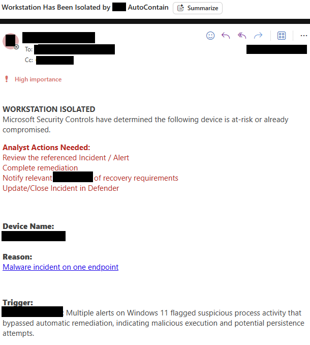

# Autonomous Incident Response: Device Isolation

An advanced Azure Logic App playbook that automatically isolates compromised devices using Microsoft Defender for Endpoint and Azure OpenAI summarization.

## What This Playbook Does

- Triggers from Microsoft Sentinel incident creation or incident updates.
- Retrieves device and alert evidence from Microsoft Graph and Defender for Endpoint.
- Identifies active remediation events and active device entities.
- Uses an Azure OpenAI agent (`gpt-4o-mini`) to generate concise pre-isolation summaries.
- Applies conditional network isolation with server/workstation and after-hours guardrails.
- Confirms isolation completion through MDE machine action polling.
- Sends SOC notification emails based on outcome, asset classification, and business hours.

## Notification Behavior

When the playbook runs, it generates SOC-facing notifications that include:

- affected device details and alert context
- isolation outcome and confirmation status
- AI-generated behavioral summary
- a Sentinel incident link for analyst follow-up



## Workflow Architecture

### Trigger

- `deploy/automation-rules/sentinel-on-creation.json` fires on incident creation when the title matches configured trigger keywords.
- `deploy/automation-rules/sentinel-on-update.json` fires on incident update when new alerts are added and the title matches configured trigger keywords.

### Alert Processing

- The workflow iterates through incident alerts in `For_Each_Alert`.
- It queries Microsoft Graph Security API to retrieve alert evidence.
- Active file evidence is filtered and active device entities are collected.

### AI Summary Generation

- `Summary_Agent` calls Azure OpenAI (`gpt-4o-mini`) to summarize alert and device evidence.
- It returns a 1-2 line pre-isolation summary that includes the device name.

### Host Isolation

- The workflow iterates through active hosts in `For_Each_Host`.
- It evaluates whether the current time is after-hours using Central Standard Time (`8:00 AM` to `8:00 PM` CST).
- It determines server versus workstation status and applies appropriate isolation logic.
- It uses guardrails to avoid aggressive isolation on critical or after-hours systems.

### State Validation

- An `Until` loop polls MDE machine action logs every 60 seconds.
- It confirms whether isolation completed successfully.
- It retries up to 15 times before concluding the operation.

## Required Connections and Permissions

### Azure Logic App Connections

- `azuresentinel` - incident trigger and incident read operations
- `wdatp` - Microsoft Defender for Endpoint isolation operations
- `keyvault` - retrieving the Graph API secret
- `office365` - sending SOC notification emails

### Microsoft Graph and Key Vault

- The Logic App retrieves the Graph API secret from Key Vault using the configured `secretName`.
- Grant the Logic App managed identity `Get` permission on the Key Vault secret.
- The Graph client needs permissions to read security alert and device evidence.

## Deployment Files

- `deploy/logic-app/workflow.json`
- `deploy/automation-rules/sentinel-on-creation.json`
- `deploy/automation-rules/sentinel-on-update.json`

## Deployment Parameters

### Logic App ARM Template Parameters

| Parameter | Type | Default | Description |
|---|---|---|---|
| `logicAppName` | string | `AutoIsolate-Playbook` | Name of the Logic App workflow resource |
| `location` | string | `[resourceGroup().location]` | Azure region for deployment |
| `subscriptionId` | string | `[subscription().subscriptionId]` | Subscription containing the Logic App |
| `resourceGroupName` | string | `[resourceGroup().name]` | Resource group containing the Logic App |
| `keyVaultName` | string | `your-keyvault-name` | Key Vault storing Graph credentials |
| `secretName` | string | `GraphApiSecret` | Key Vault secret name for Graph client secret |
| `graphTenantId` | string | `00000000-0000-0000-0000-000000000000` | Azure AD tenant ID for Graph authentication |
| `graphClientId` | string | `00000000-0000-0000-0000-000000000000` | Graph client ID with `SecurityAlert.ReadWrite.All` permissions |

### Logic App Runtime Parameters

| Parameter | Type | Description |
|---|---|---|
| `CLOSED_CONTROL` | boolean | Skip processing if the incident is already closed |
| `PREVENTED_CONTROL` | boolean | Skip processing if the alert title indicates prevention or blocking |
| `SENDTOSOC` | boolean | Enable SOC email notifications |
| `ISOLATE_CONTROL` | boolean | Master toggle for isolation actions |
| `AFTERHOURS_CONTROL` | boolean | Allow isolation outside business hours |

### Automation Rule Parameters

| Parameter | Type | Default | Description |
|---|---|---|---|
| `workspaceName` | String | none | Sentinel Log Analytics workspace name |
| `subscriptionId` | String | `[subscription().subscriptionId]` | Azure subscription containing the Logic App |
| `resourceGroupName` | String | none | Resource group containing the Logic App |
| `logicAppName` | String | `AutoIsolate-Playbook` | Target Logic App workflow name |
| `triggerKeywords` | Array | See defaults below | Incident titles that trigger automation |

#### Default `triggerKeywords`

- `Generic Threat Condition Alpha`
- `Generic Threat Condition Beta`
- `Generic Threat Condition Gamma`

## Automation Rule Behavior

- `sentinel-on-creation.json` triggers when a matching incident is created.
- `sentinel-on-update.json` triggers when a matching incident is updated with new alerts.
- Both rules invoke the same Logic App workflow.

## Deployment Example

```bash
az deployment group create \
  --resource-group <your-rg-name> \
  --template-file deploy/logic-app/workflow.json \
  --parameters \
    logicAppName="AutoIsolate-Playbook" \
    location="<your-region>" \
    keyVaultName="<your-keyvault-name>" \
    secretName="GraphApiSecret" \
    graphTenantId="<your-tenant-id>" \
    graphClientId="<your-app-registration-id>"

az deployment group create \
  --resource-group <your-rg-name> \
  --template-file deploy/automation-rules/sentinel-on-creation.json \
  --parameters \
    workspaceName="<your-workspace-name>" \
    resourceGroupName="<your-rg-name>" \
    logicAppName="AutoIsolate-Playbook"

az deployment group create \
  --resource-group <your-rg-name> \
  --template-file deploy/automation-rules/sentinel-on-update.json \
  --parameters \
    workspaceName="<your-workspace-name>" \
    resourceGroupName="<your-rg-name>" \
    logicAppName="AutoIsolate-Playbook"
```

## Monitoring & Troubleshooting

- Review Logic App runs for failures in `For_Each_Alert`, `For_Each_Host`, or `Summary_Agent`.
- Verify the `keyvault` connection can retrieve the Graph secret.
- Confirm `office365` is authorized and able to send email.
- If isolation does not occur, verify `ISOLATE_CONTROL` is enabled.
- If notifications do not send, verify `SENDTOSOC` is enabled.

## Notes

- This playbook evaluates business hours in Central Standard Time.
- The AI summary is generated as a 1-2 line pre-isolation summary.
- Customize `triggerKeywords` to match your environment’s incident naming conventions.
