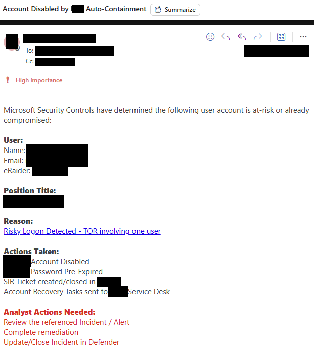

# Automated Incident Disruption: Context-Aware User Containment

An enterprise-grade Azure Logic App playbook that automatically responds to high-fidelity Sentinel incidents by disabling at-risk user accounts, generating ITSM tickets, and routing urgent executive notifications for VIP accounts.

## What This Playbook Does

- Triggers from Microsoft Sentinel incident creation or incident updates.
- Resolves account details using Microsoft Graph via Managed Service Identity.
- Detects VIP users based on `jobTitle` values such as `Chancellor`, `Provost`, `President`, `CIO`, `CFO`, `CMO`, `COO`.
- Applies automated account disablement through a custom Identity API call.
- Sends structured ITSM ticketing email notifications for standard users.
- Sends elevated VIP notification emails to executive and SOC distribution lists.
- Supports safe test mode via the `DisableInProduction` and `SendProductionEmail` runtime flags.

## Notification & Response Behavior

This playbook produces:

- A high-priority ITSM email to `itsmEmailRecipient` when a standard compromised account is disabled.
- A SOC notification to `socEmailRecipient` for account containment actions.
- A VIP escalation email to `executiveEmailRecipients` when the target account matches the VIP criteria.
- A separate test-mode email path when runtime production guards are disabled.




## Workflow Architecture

### Trigger

- `deploy/automation-rules/sentinel-on-creation.json` fires when a new incident is created and the incident title contains one of the configured high-fidelity keywords.
- `deploy/automation-rules/sentinel-on-update.json` fires when an existing incident is updated with new alerts and the incident title contains one of the same keyword values.

### Incident and Account Resolution

- The Logic App processes each matched account via `For_Each_Account`.
- It calls Microsoft Graph to fetch the user object and `onPremisesSamAccountName`/`onPremisesUserPrincipalName` details.
- It then composes a direct incident link to Sentinel for contextual email summaries.

### VIP Detection & Business Hours

- The workflow evaluates whether the user is a VIP by checking the Graph `jobTitle` for executive keywords.
- It also checks whether the current time is within business hours using Central Standard Time (`8:00 AM` to `8:00 PM` CST).
- VIP accounts are handled with elevated notifications and may be routed for hands-on review instead of broad automated disabling.

### Account Disablement

- When appropriate, the workflow calls a custom identity API endpoint to disable the account and pre-expire the password.
- Production disablement occurs when `DisableInProduction` is `true`.
- If `DisableInProduction` is `false`, the workflow enters a test branch that sends test-mode email notifications instead of disabling production accounts.

### Email Notification Paths

- **Standard account containment:** sends an ITSM ticket email to `itsmEmailRecipient` and a SOC notification to `socEmailRecipient`.
- **VIP containment:** sends a high-priority executive notification to `executiveEmailRecipients`, with the same security details and analyst action guidance.
- **Production email gating:** only sends email notifications when `SendProductionEmail` is `true`.
- **Test mode:** sends test emails to fixed internal test addresses rather than production recipients.

## Required Connections and Permissions

### Azure Logic App Connections

- `azuresentinel` - incident trigger and incident update control
- `office365` - sending email notifications
- `keyvault` - retrieving the Identity API token secret

### Azure Managed Identity

The workflow uses Managed Service Identity to authenticate to Microsoft Graph for user lookups.

### Key Vault Secret

- The Logic App retrieves `IdentityAPI` from Key Vault.
- Grant the Logic App managed identity `Get` permission on the Key Vault secret.

## Deployment Files

- `deploy/logic-app/workflow.json`
- `deploy/automation-rules/sentinel-on-creation.json`
- `deploy/automation-rules/sentinel-on-update.json`

## Deployment Parameters

### Logic App ARM Template Parameters

| Parameter | Type | Default | Description |
|---|---|---|---|
| `logicAppName` | String | `AutoIsolate-Playbook` | Name of the Logic App workflow resource |
| `location` | String | `[resourceGroup().location]` | Azure region for deployment |
| `itsmEmailRecipient` | String | `itsupport@contoso.com` | ITSM ticket email recipient |
| `socEmailRecipient` | String | `soc@contoso.com` | SOC alert email recipient |
| `executiveEmailRecipients` | String | `soc@contoso.com,soc-manager@contoso.com,ciso@contoso.com` | Comma-separated VIP notification recipients |

### Logic App Runtime Parameters

| Parameter | Type | Default | Purpose |
|---|---|---|---|
| `DisableInProduction` | Bool | `true` | Enables production account disablement path |
| `SendProductionEmail` | Bool | `true` | Enables production email notifications |
| `DISABLE` | String | `Active` | Indicates the active deployment mode for the playbook |

### Automation Rule Parameters

| Parameter | Type | Default | Description |
|---|---|---|---|
| `workspaceName` | String | none | Sentinel Log Analytics workspace name |
| `subscriptionId` | String | `[subscription().subscriptionId]` | Azure subscription where the Logic App resides |
| `resourceGroupName` | String | none | Resource group containing the target Logic App |
| `logicAppName` | String | `AutoContain-Playbook` | Target Logic App workflow name |
| `highFidelityIncidentKeywords` | Array | See defaults below | Incident titles that trigger automation |

#### Default `highFidelityIncidentKeywords`

- `Generic High-Risk Condition Alpha`
- `Generic High-Risk Condition Beta`
- `Suspicious Credential Activity Example`
- `Potential Attacker Infrastructure Detection Pattern`

## Automation Rule Behavior

- `sentinel-on-creation.json` triggers immediately when a new incident is created and the title contains one of the configured keywords.
- `sentinel-on-update.json` triggers when an incident is updated and a new alert is added, provided the title contains one of the configured keywords.

Both rules execute the same `AutoContain-Playbook` Logic App.

## Deployment Example

```bash
az deployment group create \
  --resource-group <your-rg-name> \
  --template-file deploy/logic-app/workflow.json \
  --parameters \
    logicAppName="AutoIsolate-Playbook" \
    location="<your-region>" \
    itsmEmailRecipient="itsupport@contoso.com" \
    socEmailRecipient="soc@contoso.com" \
    executiveEmailRecipients="soc@contoso.com,soc-manager@contoso.com,ciso@contoso.com"

az deployment group create \
  --resource-group <your-rg-name> \
  --template-file deploy/automation-rules/sentinel-on-creation.json \
  --parameters \
    workspaceName="<your-workspace-name>" \
    resourceGroupName="<your-rg-name>" \
    logicAppName="AutoIsolate-Playbook"

az deployment group create \
  --resource-group <your-rg-name> \
  --template-file deploy/automation-rules/sentinel-on-update.json \
  --parameters \
    workspaceName="<your-workspace-name>" \
    resourceGroupName="<your-rg-name>" \
    logicAppName="AutoIsolate-Playbook"
```

## Monitoring & Troubleshooting

- Check Logic App run history for failure details in `For_Each_Account`, Graph API calls, or the identity disable step.
- Verify the `keyvault` connection can retrieve the `IdentityAPI` secret and that the Logic App managed identity has `Get` permissions.
- Confirm the `office365` connection is authorized and able to send mail.
- If disabling is not occurring, confirm `DisableInProduction` is set to `true` and that the workflow is not in the test branch.
- If email is not delivered, confirm `SendProductionEmail` is `true` and the recipients are configured correctly.

## Notes

- This playbook uses Central Standard Time for business-hours evaluation.
- The VIP detection logic is driven from `jobTitle` values and may need to be adapted to match your organization’s executive naming conventions.
- The account containment API endpoint is currently hard-coded to `https://api.contoso.com/identity/user/.../Account`; update this to your identity service endpoint during deployment.
