# Automated Incident Response: User Containment

An enterprise-grade Azure Logic App playbook that automatically responds to high-fidelity Sentinel incidents by disabling at-risk user accounts, generating ITSM tickets, and routing urgent executive notifications for VIP accounts.

## What This Playbook Does

- Triggers from Microsoft Sentinel incident creation or incident updates.
- Resolves account details using Microsoft Graph via Managed Service Identity.
- Detects VIP users based on configured executive job titles.
- Applies automated account disablement through a custom Identity API call.
- Sends structured ITSM ticket notifications for standard users.
- Sends elevated VIP notifications to executive and SOC distribution lists.
- Supports safe test mode via `DisableInProduction` and `SendProductionEmail` runtime flags.


## Workflow Architecture

### Trigger

- [`deploy/automation-rules/sentinel-on-creation.json`](deploy/automation-rules/sentinel-on-creation.json) fires on incident creation when the title matches one of the configured high-fidelity keywords.
- [`deploy/automation-rules/sentinel-on-update.json`](deploy/automation-rules/sentinel-on-update.json) fires on incident update when new alerts are added and the title matches one of the configured keywords.
- [`deploy/logic-app/workflow.json`](deploy/logic-app/workflow.json) is the deployable ARM template for the Logic App workflow.

```mermaid
flowchart TD
    %% Trigger & Initialization
    Trigger([Sentinel Incident Created]) --> StatusCheck{Is Incident Eligible?}
    StatusCheck -->|No| Cancel([❌ Terminate Playbook])
    StatusCheck -->|Yes| Init[Initialize Variables]

    %% User Correlation
    Init --> DiscoverUsers

    subgraph DiscoverUsers [🔍 Identify the Correct User]
        direction TB

        CollectUsers[Extract Related User Entities]
        CollectUsers --> Normalize[Normalize & Remove Duplicates]

        Normalize --> SingleUser{Only One User Found?}

        SingleUser -->|Yes| SelectUser[Select Matching User]
        SingleUser -->|No| SearchAlerts[Query Sentinel Alerts]

        SearchAlerts --> AlertReady{Matching Alerts Found?}
        AlertReady -->|No| Delay[Wait 30 Seconds]
        Delay --> SearchAlerts

        AlertReady -->|Yes| Correlate[Correlate Accounts to Alert Titles]
        Correlate --> MatchFound{Unique Match Identified?}

        MatchFound -->|Yes| SelectUser
        MatchFound -->|No| CompareIncident[Compare Incident Alert Metadata]
        CompareIncident --> SelectUser
    end

    %% Identity Processing
    SelectUser --> IdentityLoop

    subgraph IdentityLoop [🔁 Process Selected Account]
        direction TB

        GetProfile[Retrieve User & On-Prem Identity]
        GetProfile --> BuildContext[Generate Incident Context]
        BuildContext --> CheckHours[Determine Business Hours]
        CheckHours --> CheckVIP[Determine VIP Status]

        CheckVIP --> DisableGate{Should Account Be Automatically Disabled?}

        DisableGate -->|Yes| DisableAccount[Disable Account & Reset Password]
        DisableGate -->|No| NotifyVIP[Escalate VIP Without Disabling]
    end

    %% Notification Routing
    DisableAccount --> EmailMode
    NotifyVIP --> EmailMode

    EmailMode{Production Notifications Enabled?}

    EmailMode -->|Yes| ITSM[Create ITSM Recovery Ticket]
    ITSM --> VIPRoute{VIP User?}

    VIPRoute -->|Yes| ExecEmail[Notify Executive Recovery Team]
    VIPRoute -->|No| SOCEmail[Notify SOC]

    EmailMode -->|No| TestTicket[Test ITSM Ticket]
    TestTicket --> TestEmail[Test SOC Notification]

    %% Completion
    ExecEmail --> Complete([✅ Playbook Complete])
    SOCEmail --> Complete
    TestEmail --> Complete
```



## Notification Behavior

When the playbook runs, it generates contextual incident notifications that include:

- User identity details (display name, UPN, sAMAccountName, job title)
- Containment status and audit context
- ITSM ticket creation and account recovery guidance
- Escalation instructions for VIP accounts


## Required Connections and Permissions

### Azure Logic App API Connections

This ARM template expects the following Azure API Connection resources to already exist in the target subscription/resource group.

| Connection Alias | Azure Resource Type | Purpose |
|---|---|---|
| `azuresentinel` | `Microsoft.Web/connections` | Microsoft Sentinel incident trigger and incident read/update actions |
| `office365` | `Microsoft.Web/connections` | ITSM, SOC, VIP, and test email notifications |
| `keyvault` | `Microsoft.Web/connections` | Key Vault secret retrieval for the Identity API token |

### Required Existing API Connection Parameters

The ARM template wires the Logic App to existing API connections using full Azure resource IDs.

| Parameter | Expected Resource Type | Purpose |
|---|---|---|
| `connections_azuresentinel_externalid` | `Microsoft.Web/connections` | Existing Microsoft Sentinel API connection |
| `connections_office365_externalid` | `Microsoft.Web/connections` | Existing Office 365 API connection |
| `connections_keyvault_externalid` | `Microsoft.Web/connections` | Existing Key Vault API connection |

Each value must be the full resource ID of an existing API Connection:

```text
/subscriptions/<subscription-id>/resourceGroups/<resource-group-name>/providers/Microsoft.Web/connections/<connection-name>
```

If these API Connection resources do not exist, ARM validation may pass, but deployment can fail with a `NotFound` error.

### Azure Managed Identity

The playbook uses the Logic App system-assigned managed identity to authenticate to Microsoft Graph.

The managed identity must be authorized for the Microsoft Graph calls used by the workflow, including user lookup and on-premises attribute lookup.

### Key Vault Secret

- The workflow retrieves the Identity API token from Key Vault using the configured `identityApiSecretName` parameter.
- The default secret name is `IdentityAPI`.
- Grant the Logic App managed identity `Get` permission for the Key Vault secret.

### Identity API

The workflow calls the configured identity-management API to disable/reset accounts.

| Parameter | Default | Description |
|---|---|---|
| `identityApiBaseUrl` | `https://api.contoso.com` | Base URL for the identity-management API. Do not include a trailing slash |
| `identityApiSecretName` | `IdentityAPI` | Key Vault secret name containing the Identity API token |
| `identityApiTestUsername` | `testuser01` | Test account used when production disablement is disabled |

## Deployment Files

- [`deploy/logic-app/workflow.json`](deploy/logic-app/workflow.json)
- [`deploy/automation-rules/sentinel-on-creation.json`](deploy/automation-rules/sentinel-on-creation.json)
- [`deploy/automation-rules/sentinel-on-update.json`](deploy/automation-rules/sentinel-on-update.json)

## Deployment Parameters

### Logic App ARM Template Parameters

| Parameter | Type | Default | Description |
|---|---|---|---|
| `logicAppName` | String | `UserContainment-Playbook` | Name of the Logic App workflow resource |
| `location` | String | `[resourceGroup().location]` | Azure deployment region |
| `connections_azuresentinel_externalid` | String | `[resourceId('Microsoft.Web/connections', 'azuresentinel')]` | Full resource ID of the existing Microsoft Sentinel API connection |
| `connections_office365_externalid` | String | `[resourceId('Microsoft.Web/connections', 'office365')]` | Full resource ID of the existing Office 365 API connection |
| `connections_keyvault_externalid` | String | `[resourceId('Microsoft.Web/connections', 'keyvault')]` | Full resource ID of the existing Key Vault API connection |
| `itsmEmailRecipient` | String | `itsupport@contoso.com` | Production destination for automated ITSM support tickets |
| `socEmailRecipient` | String | `soc@contoso.com` | Main SOC email destination for standard alerts |
| `executiveEmailRecipients` | String | `soc@contoso.com,soc-manager@contoso.com,ciso@contoso.com` | Comma-separated recipients notified when a VIP account is targeted |
| `securityAlertsEmailRecipient` | String | `security-alerts@contoso.com` | Shared security-alerts mailbox used for CC and testing notifications |
| `testItsmEmailRecipient` | String | `itsm-test@contoso.com` | Test destination used instead of the production ITSM mailbox |
| `testSocEmailRecipient` | String | `soc-test@contoso.com` | Test destination used instead of the production SOC mailbox |
| `identityApiBaseUrl` | String | `https://api.contoso.com` | Base URL for the identity-management API. Do not include a trailing slash |
| `identityApiSecretName` | String | `IdentityAPI` | Key Vault secret name containing the Identity API token |
| `identityApiTestUsername` | String | `testuser01` | Test account used when production disablement is disabled |
| `disableInProduction` | Bool | `true` | Enables production account disablement |
| `sendProductionEmail` | Bool | `true` | Enables production email notifications |
| `disableMode` | String | `Active` | Display/status label included in testing emails |
| `workdayTimezone` | String | `Central Standard Time` | Windows time-zone ID used for business-hour checks |
| `businessHourStart` | Int | `8` | Start of business hours in 24-hour local time |
| `businessHourEnd` | Int | `20` | End of business hours in 24-hour local time |
| `vipDisableAlertKeyword1` | String | `This Alert Title should Disable a VIP` | Incident or alert title keyword that permits automated VIP disablement |
| `vipDisableAlertKeyword2` | String | `This Alert Title should Disable a VIP` | Optional second incident or alert title keyword that permits automated VIP disablement |

### Logic App Runtime Parameters

The ARM template maps deployment parameters into Logic App runtime parameters.

| Runtime Parameter | Type | Purpose |
|---|---|---|
| `DisableInProduction` | Bool | Enables production account disablement. When false, the workflow uses the configured test username |
| `SendProductionEmail` | Bool | Enables production email notifications. When false, the workflow sends testing notifications |
| `DISABLE` | String | Display/status label included in testing emails |

## VIP Disable Behavior

The playbook has special handling for VIP accounts.

VIP accounts are identified by job title keywords such as:

- `Chancellor`
- `Provost`
- `President`
- `CIO`
- `CFO`
- `CMO`
- `COO`

VIP account disablement is allowed only when the incident or alert title matches configured high-confidence keywords, or when the workflow is outside the configured business-hour window.

| Parameter | Purpose |
|---|---|
| `vipDisableAlertKeyword1` | First incident or alert title keyword that permits automated VIP disablement |
| `vipDisableAlertKeyword2` | Second incident or alert title keyword that permits automated VIP disablement |
| `workdayTimezone` | Time zone used for business-hour checks |
| `businessHourStart` | Start of business hours |
| `businessHourEnd` | End of business hours |

## Automation Rule Parameters

| Parameter | Type | Default | Description |
|---|---|---|---|
| `workspaceName` | String | none | Microsoft Sentinel Log Analytics workspace name |
| `subscriptionId` | String | `[subscription().subscriptionId]` | Azure subscription containing the Logic App |
| `resourceGroupName` | String | none | Resource group containing the Logic App |
| `logicAppName` | String | `UserContainment-Playbook` | Target Logic App workflow name |
| `highFidelityIncidentKeywords` | Array | See defaults below | Incident titles that trigger automation |

#### Default `highFidelityIncidentKeywords`

- `Generic High-Risk Condition Alpha`
- `Generic High-Risk Condition Beta`
- `Suspicious Credential Activity Example`
- `Potential Attacker Infrastructure Detection Pattern`

## Automation Rule Behavior

- `sentinel-on-creation.json` triggers when a matching incident is created.
- `sentinel-on-update.json` triggers when a matching incident is updated with new alerts.
- Both rules run the same Logic App workflow.

## Deployment Example

### Check Existing API Connections

Before deploying, confirm the required API Connection resources already exist in the target resource group.

```bash
az resource list \
  --resource-group <your-rg-name> \
  --resource-type Microsoft.Web/connections \
  --query "[].{name:name,id:id}" \
  --output table
```

### Deploy the Logic App

```bash
az deployment group create \
  --resource-group <your-rg-name> \
  --template-file deploy/logic-app/workflow.json \
  --parameters \
    logicAppName="UserContainment-Playbook" \
    location="<your-region>" \
    connections_azuresentinel_externalid="/subscriptions/<sub-id>/resourceGroups/<rg-name>/providers/Microsoft.Web/connections/<sentinel-connection-name>" \
    connections_office365_externalid="/subscriptions/<sub-id>/resourceGroups/<rg-name>/providers/Microsoft.Web/connections/<office365-connection-name>" \
    connections_keyvault_externalid="/subscriptions/<sub-id>/resourceGroups/<rg-name>/providers/Microsoft.Web/connections/<keyvault-connection-name>" \
    itsmEmailRecipient="itsupport@contoso.com" \
    socEmailRecipient="soc@contoso.com" \
    executiveEmailRecipients="soc@contoso.com,soc-manager@contoso.com,ciso@contoso.com" \
    securityAlertsEmailRecipient="security-alerts@contoso.com" \
    testItsmEmailRecipient="itsm-test@contoso.com" \
    testSocEmailRecipient="soc-test@contoso.com" \
    identityApiBaseUrl="https://api.contoso.com" \
    identityApiSecretName="IdentityAPI" \
    identityApiTestUsername="testuser01" \
    disableInProduction=true \
    sendProductionEmail=true \
    disableMode="Active" \
    workdayTimezone="Central Standard Time" \
    businessHourStart=8 \
    businessHourEnd=20 \
    vipDisableAlertKeyword1="This Alert Title should Disable a VIP" \
    vipDisableAlertKeyword2="This Alert Title should Disable a VIP"
```

### Deploy the Sentinel Creation Automation Rule

```bash
az deployment group create \
  --resource-group <your-rg-name> \
  --template-file deploy/automation-rules/sentinel-on-creation.json \
  --parameters \
    workspaceName="<your-workspace-name>" \
    resourceGroupName="<your-rg-name>" \
    logicAppName="UserContainment-Playbook"
```

### Deploy the Sentinel Update Automation Rule

```bash
az deployment group create \
  --resource-group <your-rg-name> \
  --template-file deploy/automation-rules/sentinel-on-update.json \
  --parameters \
    workspaceName="<your-workspace-name>" \
    resourceGroupName="<your-rg-name>" \
    logicAppName="UserContainment-Playbook"
```

## Monitoring & Troubleshooting

- If deployment fails with `NotFound`, verify the `connections_*_externalid` parameters point to existing `Microsoft.Web/connections` resources.
- If the Logic App deploys but connector actions fail, open each API Connection and complete authorization/consent where required.
- Verify the `keyvault` connection can retrieve the configured `identityApiSecretName` secret.
- Verify the Logic App managed identity has `Get` permission on the Key Vault secret.
- Verify Microsoft Graph permissions are granted for the managed identity or app model used by the workflow.
- Verify the Identity API token is valid and accepted by the configured `identityApiBaseUrl`.
- If production account disablement does not occur, verify `DisableInProduction` is enabled.
- If production emails do not send, verify `SendProductionEmail` is enabled.
- If VIP accounts are not disabled, verify the VIP alert keywords and business-hour settings.

## Notes

- This playbook evaluates business hours in Central Standard Time.
- VIP detection is based on `jobTitle` matching and may need customization.
- Update the account containment endpoint from `https://api.contoso.com/identity/user/.../Account` to your production API endpoint.
